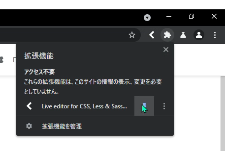
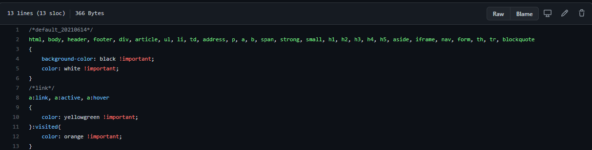
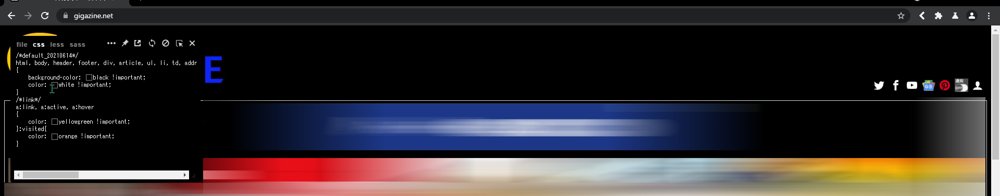
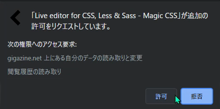

# Usage guide

## Install the extension

---

### Warning. 

<h3>Install with a browser that does not require IDs or passwords. </h3>

---

We will be using [Live editor for CSS, Less & Sass (Magic CSS) - Github](https://github.com/webextensions/live-css-editor).

Click the "Add to Chrome" button to automatically download and install it.

When the installation is complete, a notification will appear in the upper right corner.

Pin it so that you can easily apply CSS later.

## Apply CSS
As an example, let's take [Gigazine.net](https://gigazine.net) (you will be redirected to Gigazine's website).

First, after accessing the top site, download the special CSS.

[CSS for exclusive use of Gigazine](https://github.com/MenteCorp/DarkTemeAllWeb/blob/main/Japanese%20Website/gigazine.net.css)

Copy the CSS that is displayed.

Apply the CSS immediately.

Click on the Live Editor icon. Then, the editor window will appear.

Paste the code you just copied into the window. Then it will be reflected and saved automatically.

---

As it is, if you move to another article, the CSS will not be reflected. So, we will apply it to the entire domain.

Notice the window that appears when you click on the Live Editor icon.

There are several icons in the upper right corner of the window. Click on one of them, the stud icon.

The extension will then ask you for permission to access your browser.

If you press allow under your personal responsibility, the same CSS will be automatically applied to all pages whose domain name is on gigazine.net.

Well done. This is the sequence of steps to apply the dark theme.