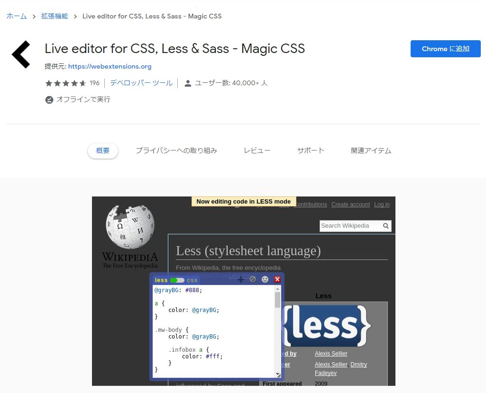
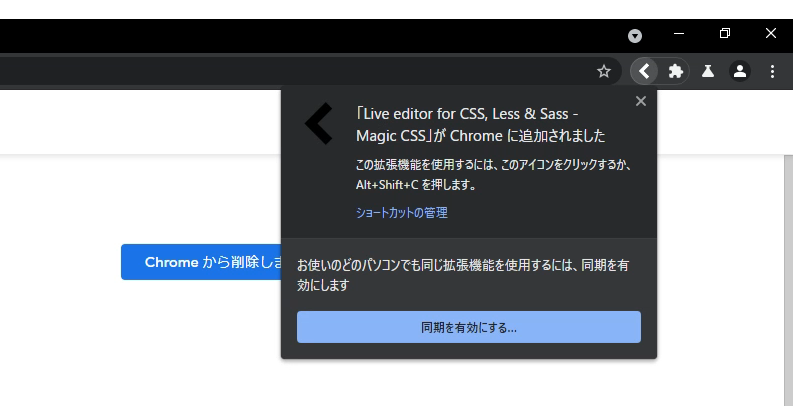
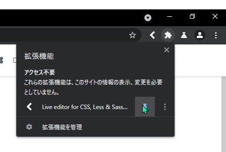
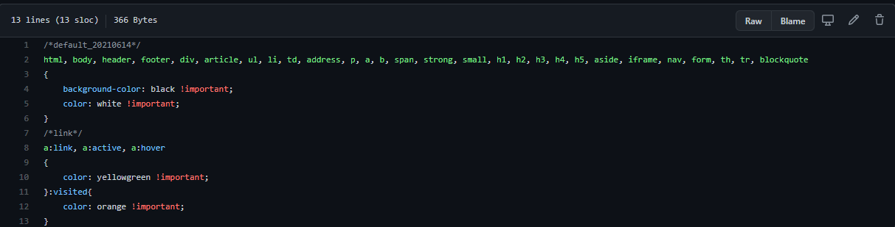
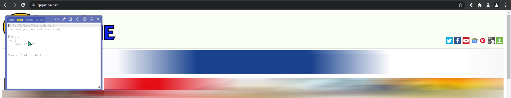
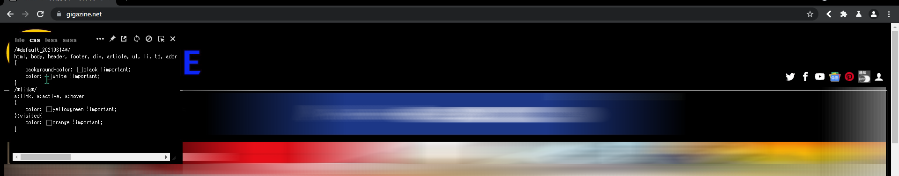
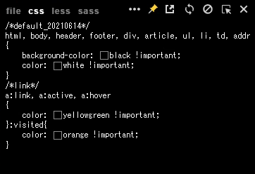
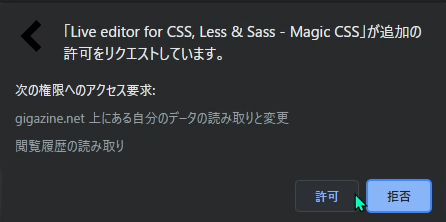

# 使い方ガイド

## Step.1 拡張機能をインストールする

---

### 警告 

<h2>IDやパスワードを入力しないブラウザでインストールしてください。</h2>

---

今回は、[Live editor for CSS, Less & Sass (Magic CSS) - Github](https://github.com/webextensions/live-css-editor)を使用します。

「Chromeに追加」ボタンを押すと自動的にダウンロードとインストールが行われます。

インストールが完了すると、右上に通知が表示されます。

後で簡単にCSSを適用できるようにピン止めします。

## CSSを適用する
例として、[Gigazine.net](https://gigazine.net)（Gigazine様のサイトへ移動します）を挙げます。

まず、トップサイトにアクセスしたら、専用のCSSをダウンロード。

[Gigazine専用のCSS](https://github.com/MenteCorp/DarkTemeAllWeb/blob/main/Japanese%20Website/gigazine.net.css)

表示されているCSSをコピーします。

さっそくCSSを適用します。

ライブエディタのアイコンをクリックしてください。すると、エディタのウインドウが表示されます。

ウインドウ内に先程コピーしたコードを貼り付けます。すると自動的に反映と保存がされます。

---

このままでは、他の記事に移動するとCSSが反映されません。そこで、ドメイン全体に適用するようにします。

ライブエディタのアイコンをクリックすると表示されるウインドウに注目してください。

ウインドウの右上に複数のアイコンがあります。これらの内、画鋲のアイコンをクリックしてください。

すると、拡張機能からブラウザへのアクセス許可が求められます。

あなた個人の責任の元で許可を押すと、ドメイン名がgigazine.net上にある全てのページで同じCSSが自動的に適用されるようになります。

よくできました。これがダークテーマを適用する一連の流れです。