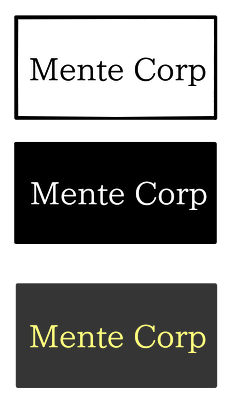

# ダークテーマについて学習する

## ダークテーマとは

ダークテーマとは画面を暗く見せるためのテーマのことです。ナイトテーマとも呼ばれます。これらの対になる言葉は、ホワイトテーマ、ライトテーマと呼ばれています。

### なぜダークテーマが必要なのか

ダークテーマ対応は主にアクセシビリティ向上のために行われます。特に光に過敏な人、夜に作業する人に有益です。

### なぜこのアプローチが必要なのですか。

以前からこの問題を解決するための技術は開発されてきました。その成果物として、ユーザー補助を使用することが出来ます。
[Chrome - ユーザー補助](https://support.google.com/chrome/answer/7040464)

ユーザー補助の内、

- ハイコントラスト

が役に立つかもしれません。しかし大抵の場合、正常に表示されません。

### ダークテーマによく使われる色

ダークテーマにどのような色を使用すればいいでしょうか。
- ライトテーマではよく、白い背景に黒い文字を使用しています。
- ダークテーマではよく、黒い背景に白い文字を使用しています。
- 最近のダークテーマでは、黒に近い色（例：#353535）などを背景にして白や他の刺激の低い色を使用しています。



## ダークテーマをWebで適用する技術

### CSS
CSSはWebサイトに表現を拡張し、彩りを与えます。CSSを書き換えることで、色味や形を大きく変えることができます。

例えば、DefaultCSSはどのようなコードが記述されているでしょうか。

```css

/*default_20210614*/
html, body, header, footer, div, article, ul, li, td, address, p, a, b, span, strong, small, h1, h2, h3, h4, h5, aside, iframe, nav, form, th, tr, blockquote
{
    background-color: black !important;
    color: white !important;
}
/*link*/
a:link, a:active, a:hover
{
    color: yellowgreen !important;
}:visited{
    color: orange !important;
}
```
- 多くのタグの背景色を黒に、文字色を白に指定しています。

- リンクの色を状態によって変化させています。このDefault.CSSであれば、未訪問リンクとアクティブ、ホバー状態にあるものをイエローグリーンに、訪問済みをオレンジに設定しています。

- 全ての要素に"!important"を追加することでCSSを「上書き」しています。
- もし、Webサイト上で"!important"が使用されている場合、上書きすることが出来ません。

---

次の例では、ユーザーが端末設定でホワイトテーマかダークテーマのどちらかを使用しているかを判別して、それに対応した適切な色を表示します。

```css

/*Light*/
/*ライトテーマを適用している端末の場合、htmlタグの背景色を白に、文字の色を黒にします。*/
@media (prefers-color-scheme: light) {
    html {
      background-color: white;
      color: black;
    }
}
/*Dark*/
/*ダークテーマを適用している端末であれば、htmlタグの背景色を黒に、文字の色を白にします。*/
@media (prefers-color-scheme: dark) {
    html {
      background-color: black;
      color: black;
    }
}
```

### 拡張機能

CSSがあれば、サイトに様々なテーマを適用できますが、単体では動作しません。ブラウザで簡単に動作させるには、拡張機能によってCSSを上書きすることで実現させることができます。  
[ガイド](guide.ja.md)をご覧ください。

## 考察

### なぜ各社Webサイトはダークテーマを適用しないのですか

ダークテーマを適用するには、適用時の検証が必要になります。
例えば、ロゴに暗い色が含まれていると、ダークテーマでは色が埋没してしまいます。それに対応するためのコストを捻出することはまれです。